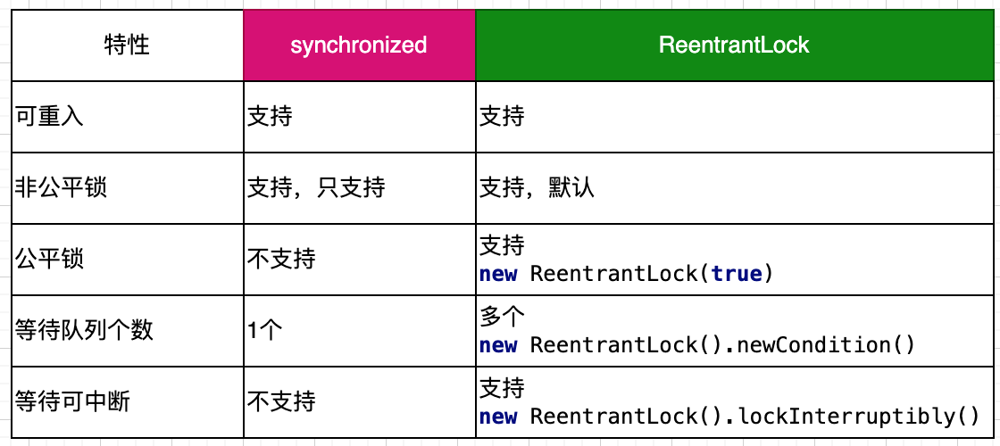
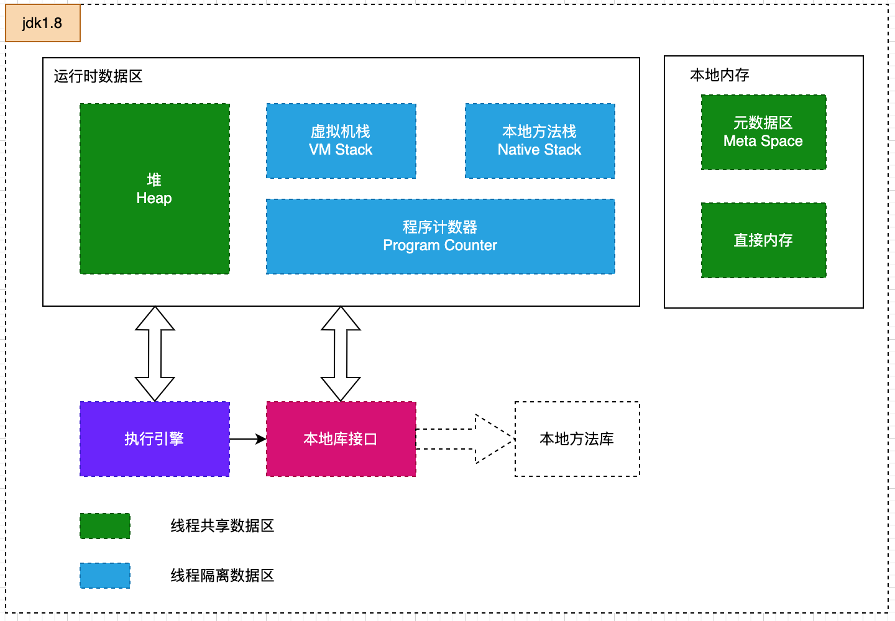

# 知识点总结

## Java基础

> 详情请跳转查看

### 基础数据类型

* boolean - 1字节，值为true或者false.
* byte - 1字节
* short - 2字节
* char - 2字节
* int - 4字节
* long - 8字节
* float - 4字节
* double - 8字节

### 面向对象特性

* 封装 - 将数据和操作封装在对象内部，只暴露必要接口供外部调用。可以提高代码的可用性和安全性，减少代码的耦合度。
* 继承 - 通过继承，子类可以通过父类从父类中继承到父类的属性和方法，并在此基础上增加或修改属性和方法。继承可以是代码更加简洁，易于维护和扩展。
* 多态 - 多态是指同一种操作作用于不同对象，会产生不同的结果。多态可以增加程序的灵活性和扩展性。
* 抽象 - 通过抽象，将具体的实现细节抽象出来，形成一个抽象的概念和接口，以便代码的重用和扩展。
* 接口 - 接口定义一组方法和属性，供外部调用。使代码更加模块化，便于维护和扩展。

### 方法重载（overload)

在一个类中，存在多个相同名字的方法，但是参数列表或者返回值不同的一组方法。

### 方法重写(override)

子类重写父类的方法。

### 泛型

Java中泛型是基于类型擦除实现的，避免在运行时出现强制类型转换错误。

### 异常

Java中异常的基类是 Throwable，包括 Error和 Exception2个子类。Error表示严重问题，无法恢复；Exception表示异常，可以恢复。可以通过 try、catch和 finally来做异常处理。

## Java集合框架

### 家族成员

* Collection接口
  * List接口： 可重复集合，实现类有 ArrayList和 LinkedList，并发实现类有 Vector。
  * Set接口：不可重复集合，实现类有 HashSet和 TreeSet，并发实现类有 ConcurrentHashSet。
  * Queue接口：队列，实现类有 LinkedList和 PriorityQueue。
  * Deque接口：双端队列，实现类有 LinkedList和 ArrayDeque。
* Map接口： hash集合接口，实现类有 HashMap、LinkedHashMap和 TreeMap，并发实现类有 ConcurrentHashMap。

### ArrayList底层实现原理

基于数组实现，可动态扩缩容，初始容量为10。

添加时，超过数组长度会扩容为原来的1.5倍；删除时，数量小于等于数组长度一半时，缩容为原来的0.75倍。

优点：基于数组下标访问快。

缺点：添加和删除元素时，可能需要扩缩容或者移动元素，速度较慢。

总结：ArrayList多用在读大于写的场景，LinkedList多用在写大于读的场景。

### HashMap底层实现原理

一种哈希表的实现，存放键值对，key唯一，value可重复。

添加(put)时，会先根据 key的hash值和数组长度取模后得到数组下标： 若下标上没有值，则直接插入节点； 若下标上有值，则调用元素值的equals方法和原位置上的值做比较，若相等则覆盖写入，若不相等则尾插法插入节点到链表。 如果链表的长度大于8且hash表的长度大于64时，JDK8会将链表转换为红黑树，以提高查询效率；当红黑树元素个数小于6时，退化为链表，已节省内存。

访问时，会先根据 key的hash值和数组长度取模后得到数组下标，然后遍历下标上的链表或者红黑树，找到对应元素的值。

扩容：当元素数量超过75%，则扩容为原来的2倍，并将数据重新分配到新数组。

缩容：当元素数量少于25%，则缩容为原来的一半，并将数据重新分配到新数组。

初始容量为16，负载因子为0.75，最大容量为2的30次方。

## IO模型

> 详情请参考网络通信IO模型

* 同步阻塞IO(BIO) - 一个线程处理一个socket读写，如果要实现多连接则需要多线程
* 同步非阻塞IO(NIO) - 一个线程可以处理多个socket读写，轮询处理多个线程
* 多路复用IO - 一个线程可以处理多个socket读写，将多个socket注册到一个复用器上，内核监控复用器中的socket，如果就绪才读取数据，（epoll）可以避免轮询带来的性能损耗。
  * select - 多路复用器，基于数组存储socket描述符，线程数量有上限1024，内核轮询询问是否有事件就绪。
  * poll - 基于链表存储socket描述符，数量无限制，内核轮询询问是否有事件就绪。
  * epoll - 基于红黑树存储socket描述符，不再轮询，使用回调机制，当某个socket就绪，内核会直接调用回调函数，不再需要轮询。
异步非阻塞IO(AIO) -
同步异步是针对数据读取是用户线程还是内核线程完成，用户线程调用read则是同步，内核调用read则是异步。

阻塞非阻塞时针对调用后是否立即返回，阻塞不会立即返回需要阻塞等待内核完成后才返回，非阻塞则会立即返回。

## Java并发（juc)

### 说说什么是Java内存模型？

1. 工作内存和主内存：Java内存模型定义了主内存和工作内存的概念。主内存是所有线程共享的内存区域，而工作内存是每个线程独有的内存区域。线程只能将主内存中的变量复制到自己的工作内存中进行操作，操作完成后再将变量的值写回到主内存中。
2. 内存屏障：
3. 8大happen-before原则：

### volatile如何保证可见性？

禁止线程对变量的本地缓存，强制线程从主内存读取变量的值，已确保该变量的可见性。 具体来说，一个线程对一个volatile变量写操作时，JVM会立即将值刷新到主内存中，并通知其他线程这个值已经被修改，当其他线程需要读取该变量值时，JVM会强制线程从主内存读取最新的值，从而保证可见性。

### syschronized vs ReentrantLock

1. 都是可重入锁。
2. syschronized只支持一个等待队列，而ReentrantLock配合Condition可支持多个等待队列。
3. syschronized只支持非公平锁，而ReentrantLock支持非公平锁和公平锁。
4. syschronized不支持等待中断，而ReentrantLock支持等待中断。

### 说说syschronized的锁升级过程？

> jdk1.6之后对syschronized做了性能优化，详细请参考锁升级。

锁信息存在对象头里的markword中，重量级锁基于操作系统的互斥量实现，没获取到锁的线程会阻塞。

1. 刚创建的对象，是无锁（001）
2. 一个线程获取锁后，变成偏向锁。（101）
3. 多个线程竞争同一个锁，会升级为轻量级锁（自适应自旋锁）。（00）
4. 当自适应自旋次数超过一定阈值或者有其他线程尝试获取锁，则会升级为重量级锁。（10）

### 线程池的核心参数有哪些？

* 核心线程数
* 最大线程数
* 存活时间
* 存活时间单位
* 阻塞队列
* 线程工厂
* 拒绝策略

### 线程池如何防止内存溢出？

设置有界的阻塞队列，防止任务提交过多导致内存溢出。

## JVM

### 类加载机制

加载、链接（验证、准备、解析）、初始化、使用、卸载

### 类加载双亲委派机制

> 详细请参考类加载器。 jdk1.2之后才引入双亲委派机制。

如果一个类加载器收到了类加载请求，先判断类是否已经被加载过，如果没有被加载会把请求委派给父加载器去完成，当父加载器无法完成加载时（它的搜索范围没有找到所需的类），子加载器才会尝试去完成加载。（ClassLoader.loadClass()方法）

可自定义类加载器，重写findClass方法来实现自己的类加载逻辑，绕过双亲委派机制。

### 运行时数据区

> 详细请参考熟悉jvm内存区域

线程共享：堆，方法区（元数据区）1.7里叫方法区，1.8叫元数据区。

线程独享：程序计数器，JVM栈，本地方法栈。

只有程序计数器不会OOM,其他的都会OOM。

### CMS垃圾回收器

> jdk1.5发布的低延迟并发垃圾回收器，适用于老年代，采用分代收集思想。

1. 初始标记（STW）：只标记GC Roots引用到的对象
2. 并发标记：从GC Roots根对象开始做可达性分析，标记能到达的对象
3. 重新标记（STW）：修正并发标记阶段用户线程修改影响的一部分对象的标记
4. 并发清除：清除非存活对象，并回收垃圾
优点：低延迟，并发收集。
缺点：会产生内存碎片，占用CPU资源导致用户线程慢。

### G1垃圾回收器

> jdk1.7发布的低延迟并发垃圾回收器，适应于老年代，采用分Region收集思想。

1. 初始标记（STW）：只标记GC Roots引用到的对象
2. 并发标记：从GC Roots根对象开始做可达性分析，标记能到达的对象
3. 最终标记（STW）：修正并发标记阶段用户线程修改影响的一部分对象的标记
4. 筛选回收：对堆中的各个Region做回收价值和成本排序，结合用户预期停顿时间制定回收计划并执行。
优点：并行并发收集，低延迟，无内存碎片。

实现细节：请参考卡表 和 记忆集。

### 执行引擎

## Spring

## Spring中Bean的生命周期

### Spring是如何解决循环依赖的

3级缓存 + 提前暴露对象

实例化，依赖注入，初始化

* 一级缓存 singtonObjects - 存放已经完全创建好的bean的单例对象
* 二级缓存 earlySingtonObjects - 存放早期暴露的bean对象，实例化完成还没有依赖注入和初始化的bean
* 三级缓存 singtonFactories - 存放创建bean的工厂对象，当获取一个bean时，如果没有被创建，会先从 singtonFactories 中获取其对应bean工厂，然后使用bean工厂创建bean对象，并将创建成功的bean对象放到 singtonObjects 中。

### 2级缓存就可以解决循环依赖，为什么要3级缓存呢？

二级缓存任然存在一些限制，比如如果Bean对象在初始化过程中出现异常无法完成创建，这样还是会出现循环依赖问题。

## SpringBoot

### SpringBoot和Spring比，优势在哪？

快速开发：通过自动配置（注解），减少大量的xml配置。
简化部署：打包为jar或者war，内嵌servlet容器，简化部署。
易于测试
生态丰富：通过starter快速集成各种中间件。

### SpringBoot的核心注解有哪些？

@SpringBootApplication：这是Spring Boot应用的主要注解，它组合了@Configuration、@EnableAutoConfiguration和@ComponentScan三个注解，用于启动Spring Boot应用。
@RestController: 定义一个只返回json数据的控制器，更适应前后端分离式开发。

## 微服务SpringCloud

### 微服务组件有哪些

* 注册中心 - eukera 、 (nacos、consxx)
* 网关 - spring cloud gateway 、 (zuul)
* 调用 - feign
* 负载均衡 - ribbon
* 限流熔断 - hystrix
* 配置中心 - spring cloud config 、 (nacos)

## 微服务Dubbo

## 分布式理论

### 基础理论CAP

* C - 一致性，指集群中所有节点的数据一致
* A - 可用性，指集群服务对外能响应请求
* P - 分区容错性，指数据需要分片，防止单点故障
论文指出，一般只能保证其中的2者，不能同时保证3者。

### 负载均衡 - 一致性Hash算法

## Zookeeper

### zookeeper中的节点类型

* 持久节点
* 临时节点
* 持久顺序节点
* 临时顺序节点

### zookeeper是如何实现分布式锁？

基于临时顺序节点 + watch节点监控来实现。

## 分布式缓存Redis

### 消息队列Kafka

## 分布式锁

### 分布式锁的实现方式？

* 基于数据库实现，插入数据表示获取锁。
* 基于redis实现，String类型的setNX方法实现，抢着key，并使用expire命令设置适当的过期时间(可以用multi和exec来保证获取锁的原子性)，防止死锁。（进阶可以使用红锁）
* 基于zookeeper实现，临时顺序节点 + watch节点监控实现，临时顺序节点保证锁失效后zk会清除防止死锁，watch监控则保证锁释放后后面顺序的等待线程能获取到分布式锁。

## 分布式事务

### 什么是分布式事务？

是跨越多个节点的事务，需要协调多个参与者的操作，保证都成功或者都失败。 主要有如下实现方式：

1. 2PC协议（2阶段提交） 2PC协议是最常用的分布式事务协议，它采用“两阶段提交”的方式来协调分布式事务。2PC协议的实现复杂，但能够保证事务的一致性和可靠性。
2. TCC事务（补偿性事务） TCC事务是一种补偿性事务，它通过在每个参与者中实现“尝试（try）”、“确认（confirm）”和“取消（cancel）”三个操作来实现事务的提交和回滚。TCC事务的实现相对简单，但需要应用程序对业务逻辑进行分解。
3. 基于消息的事务 基于消息的事务是一种异步事务，它通过消息队列来实现事务的提交和回滚。在基于消息的事务中，每个参与者都将操作封装成消息发送到消息队列中，如果所有消息都发送成功，则事务提交成功，否则进行回滚操作。基于消息的事务能够实现高可用性和可伸缩性，但需要应用程序对消息传递进行处理。
4. 最终一致性事务 最终一致性事务是一种弱一致性事务，它通过异步复制来实现数据的最终一致性。在最终一致性事务中，参与者提交事务时不需要等待其他参与者的响应，数据最终一致性由后台的异步复制机制来保证。最终一致性事务的实现相对简单，但需要应用程序进行一些额外的逻辑处理。

在选择分布式事务的实现方式时，需要根据应用场景和需求进行选择。 例如，如果要求事务的一致性和可靠性较高，则可以选择2PC协议；如果需要实现高可用性和可伸缩性，则可以选择基于消息的事务。

## 算法

1. 求一个数N是否为质数(只能背自己和1整除)，只需要判断2到sqrt(N)之间是否能找到因子，找不到则是质数。
2. Java的TreeSet数据结构，基于红黑树实现，提供唯一且有序的集合功能。
3. Java的Math库函数：

   * abs：计算绝对值
   * sqrt：计算平方根
   * pow：计算幂次方
   * sin、cos、tan：计算三角函数值
   * asin、acos、atan：计算三角函数的反函数值
   * log、log10：计算自然对数和10为底的对数
   * random：生成一个[0,1)之间的随机数
   * ceil、floor、round：对浮点数进行上取整、下取整、四舍五入等操作
   * max、min：求两个数的最大值和最小值
   * hypot：计算两个数的平方和的平方根
4. 基于优先级队列PriorityQueue排序，支持重复元素，而TreeSet则不支持重复。
