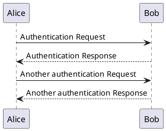
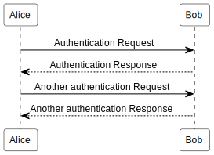
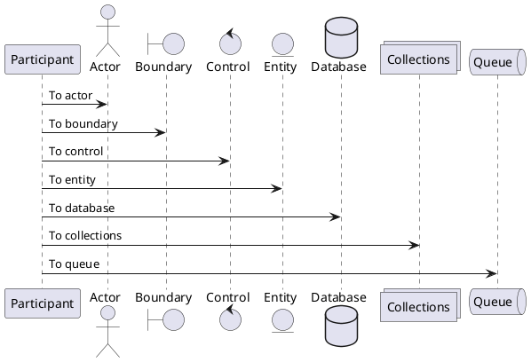
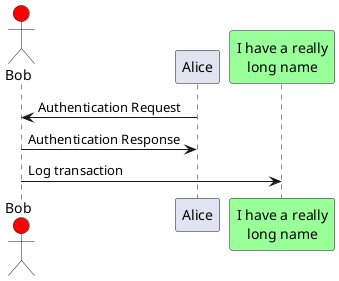
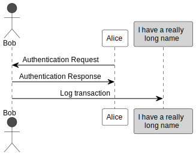
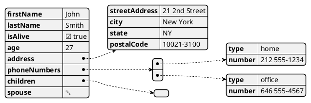
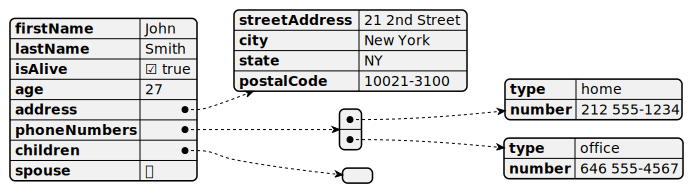
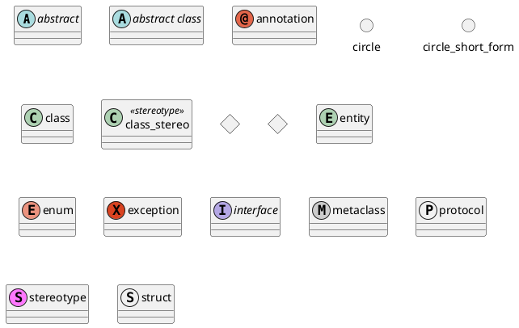
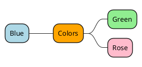
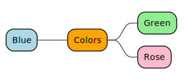

# docsify 插件用法

## 提示信息

> 依赖插件： [docsify-plugin-flexible-alerts](https://www.npmjs.com/package/docsify-plugin-flexible-alerts)

### 代码示例

```markdown
> [!TIP]
> 这是一个提示

> [!NOTE]
> 这是一个记录

> [!WARNING]
> 这是一个警告

> [!ATTENTION]
> 这是一个错误
```

### 效果展示
>
> [!TIP]
> 这是一个提示

> [!NOTE]
> 这是一个记录

> [!WARNING]
> 这是一个警告

> [!ATTENTION]
> 这是一个错误

---

## 问答展示（手风琴）

> 依赖插件： [docsify-accordion](https://www.npmjs.com/package/docsify-accordion)
>
### 代码示例

```markdown
+ 问题1? +

    [制表符]答案1

+ 问题2? +

    答案2  
    [制表符]第二行

+ 问题1 +

    [制表符]回答1  

+ 问题3 +

    [制表符]回答3
```

### 效果展示

+ 问题1? +

    答案1

+ 问题2? +

    答案2  
    第二行

+ 问题1 +

    回答1  

+ 问题3 +

    回答3

---

## tab（标签页）

> 依赖插件： [docsify-tabs](https://www.npmjs.com/package/docsify-tabs)

### 代码示例

```markdown
<!-- tabs:start -->

#### **Bold**

内容：**Bold**

#### **`<em>`Italic`</em>`**

内容：**`<em>`Italic`</em>`**

#### **`<span style="color: red;">`Red**

内容：**`<span style="color: red;">`Red**

#### **😄**

内容：**😄**

#### **😀**

内容：**😀**

#### **Badge `<span class="tab-badge">`New!**

内容：**Badge `<span class="tab-badge">`New!**

<!-- tabs:end -->

```

### 效果展示

<!-- tabs:start -->

#### **Bold**

内容：**Bold**

#### **`<em>`Italic`</em>`**

内容：**`<em>`Italic`</em>`**

#### **`<span style="color: red;">`Red**

内容：**`<span style="color: red;">`Red**

#### **😄**

内容：**😄**

#### **😀**

内容：**😀**

#### **Badge `<span class="tab-badge">`New!**

内容：**Badge `<span class="tab-badge">`New!**

<!-- tabs:end -->

---

## HTML 预览示例

> 官网：[docsify-demo](https://www.npmjs.com/package/docsify-demo)

### 代码示例

````html
```html preview
<p>Hello, World.</p>
```
````

### 效果展示

```html preview
  <p>Hello Docsify</p>
<b style="color: red;">Inline styles are supported too.</b>
<b style="color: blue;">Test.</b>
<div>
    <span>
        <b style="color: blue;">Test.</b>
    </span>
</div>
```

---

## 加载远程md文件

### 代码示例

````markdown
[rmd](远程md文档路径地址)
```
````

### 效果展示

---

## 分栏

> 官网：[docsify-demo](https://www.npmjs.com/package/docsify-pdf-embed-plugin)

### 代码示例

```markdown
<!-- panels:start -->
<!-- div:title-panel -->

  (...) - Awesome title

<!-- div:left-panel -->

  (...) - Awesome explanation

<!-- div:right-panel -->

  (...) - Awesome example

<!-- panels:end -->
```

### 效果展示
<!-- panels:start -->
<!-- div:title-panel -->

  (...) - Awesome title

<!-- div:left-panel -->

  (...) - Awesome explanation

<!-- div:right-panel -->

  (...) - Awesome example

<!-- panels:end -->

---

## pdf预览

> 官网：[docsify-pdf-embed-plugin](https://www.npmjs.com/package/docsify-pdf-embed-plugin)

### 代码示例

````txt
```pdf
[文件路径]
```
````

### 效果展示

```pdf
../../pdf/优知学院-Spring Boot面试题与答案.pdf
```

---

## PlantUml 图绘制

> 官网： <https://plantuml.com/zh/>

> [!ATTENTION]
> 该功能需要联网

### 序列图

#### 代码示例

````markdown

````

#### 效果展示



### 声明参与者



#### 代码示例

````markdown


````

#### 效果展示



### json 图

#### 代码示例

````markdown

````

#### 效果展示



### 类图



### 思维导图

#### 代码示例

````markdown


````

#### 效果展示


