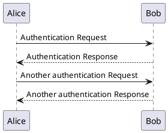
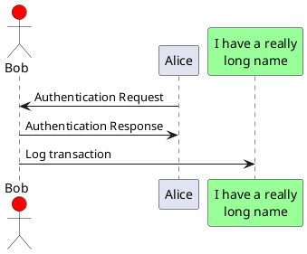
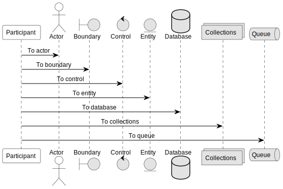
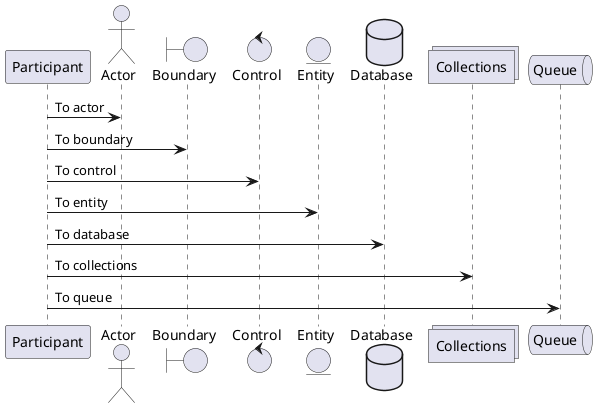
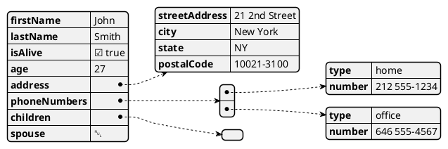
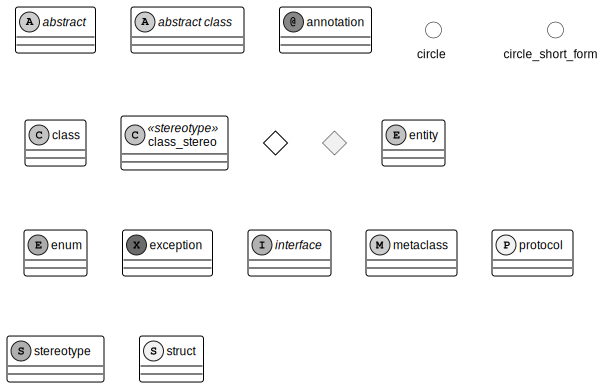
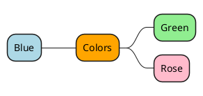
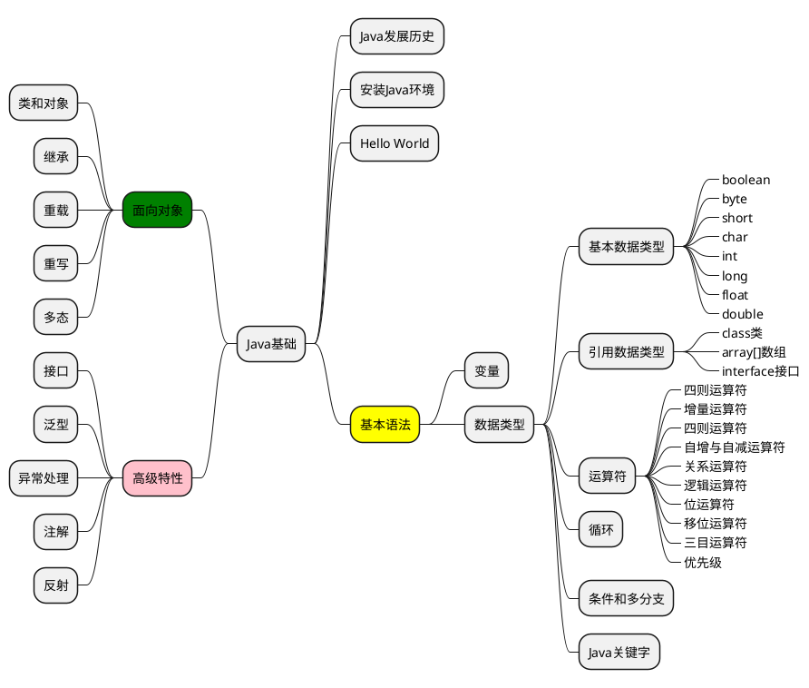

# docsify 插件用法

<!-- panels:start -->
<!-- div:title-panel -->

## 提示信息

> 依赖插件： [docsify-plugin-flexible-alerts](https://www.npmjs.com/package/docsify-plugin-flexible-alerts)

<!-- div:left-panel -->

**效果展示**

> [!TIP]
> 这是一个提示

> [!NOTE]
> 这是一个记录

> [!WARNING]
> 这是一个警告

> [!ATTENTION]
> 这是一个错误

<!-- div:right-panel -->

**代码示例**

```markdown
> [!TIP]
> 这是一个提示

> [!NOTE]
> 这是一个记录

> [!WARNING]
> 这是一个警告

> [!ATTENTION]
> 这是一个错误
```

<!-- panels:end -->

---

<!-- panels:start -->
<!-- div:title-panel -->

## 问答展示（手风琴）

> 依赖插件： [docsify-accordion](https://www.npmjs.com/package/docsify-accordion)

<!-- div:left-panel -->

**效果展示**

+ 问题1? +

    答案1

+ 问题2? +

    答案2  
    第二行

+ 问题1 +

    回答1  

+ 问题3 +

    回答3

<!-- div:right-panel -->

**代码示例**

```markdown
+ 问题1? +

    [制表符]答案1

+ 问题2? +

    答案2  
    [制表符]第二行

+ 问题1 +

    [制表符]回答1  

+ 问题3 +

    [制表符]回答3
```

<!-- panels:end -->

---

<!-- panels:start -->
<!-- div:title-panel -->

## tab（标签页）

> 依赖插件： [docsify-tabs](https://www.npmjs.com/package/docsify-tabs)

<!-- div:left-panel -->

**效果展示**

<!-- tabs:start -->

#### **Bold**

内容：**Bold**

#### **<em>Italic</em>**

内容：**<em>Italic</em>**

#### **<span style="color: red;">Red**

内容：**<span style="color: red;">Red**

#### **😄**

内容：**😄**

#### **😀**

内容：**😀**

#### **Badge <span class="tab-badge">New!**

内容：**Badge <span class="tab-badge">New!**

<!-- tabs:end -->

<!-- div:right-panel -->

**代码示例**

```markdown
<!-- tabs:start -->

#### **Bold**

内容：**Bold**

#### **<em>Italic</em>**

内容：**<em>Italic</em>**

#### **<span style="color: red;">Red**

内容：**<span style="color: red;">Red**

#### **😄**

内容：**😄**

#### **😀**

内容：**😀**

#### **Badge <span class="tab-badge">New!**

内容：**Badge <span class="tab-badge">New!**

<!-- tabs:end -->

```

<!-- panels:end -->

---

<!-- panels:start -->
<!-- div:title-panel -->

## HTML 预览示例

> 官网：[docsify-demo](https://www.npmjs.com/package/docsify-demo)

<!-- div:left-panel -->

**效果展示**

```html preview
<p>Hello Docsify</p>
<b style="color: red;">Inline styles are supported too.</b>
<b style="color: blue;">Test.</b>
<div>
    <span>
        <b style="color: blue;">Test.</b>
    </span>
</div>
```
<!-- div:right-panel -->

**代码示例**

````html
```html preview
<p>Hello Docsify</p>
<b style="color: red;">Inline styles are supported too.</b>
<b style="color: blue;">Test.</b>
<div>
    <span>
        <b style="color: blue;">Test.</b>
    </span>
</div>
```
````

<!-- panels:end -->

---

## 加载远程md文件

<!-- tabs:start -->

#### **加载远程md文件效果展示**

#### **加载远程md文件代码示例**

````markdown
[rmd](远程md文档路径地址)
````

<!-- tabs:end -->
---

## 分栏

> 官网：[docsify-example-panels](https://www.npmjs.com/package/docsify-example-panels)

<!-- tabs:start -->

#### **分栏效果展示**

<!-- panels:start -->
<!-- div:title-panel -->

  (...) - Awesome title

<!-- div:left-panel -->

  (...) - Awesome explanation

<!-- div:right-panel -->

  (...) - Awesome example

<!-- panels:end -->
#### **分栏代码示例**

```markdown
<!-- panels:start -->
<!-- div:title-panel -->

  (...) - Awesome title

<!-- div:left-panel -->

  (...) - Awesome explanation

<!-- div:right-panel -->

  (...) - Awesome example

<!-- panels:end -->
```

<!-- tabs:end -->

---

## pdf预览

> 官网：[docsify-pdf-embed-plugin](https://www.npmjs.com/package/docsify-pdf-embed-plugin)

<!-- tabs:start -->

### **效果展示**

```pdf
pdf/优知学院-Spring Boot面试题与答案.pdf
```

### **代码示例**

````txt
```pdf
[文件路径]
```
````

<!-- tabs:end -->

---

## 网站计数

> 官网：[docsify-busuanzi](https://www.npmjs.com/package/docsify-busuanzi)

---

## PlantUml 图绘制

> 官网： <https://plantuml.com/zh/>

> [!ATTENTION]
> 该功能需要联网

<!-- panels:start -->
<!-- div:title-panel -->

### 序列图

<!-- div:left-panel -->

**效果展示**


<!-- div:right-panel -->

**代码示例**

````markdown

````

<!-- panels:end -->

***

<!-- panels:start -->
<!-- div:title-panel -->

### 声明参与者

<!-- div:left-panel -->

**效果展示**


<!-- div:right-panel -->

**代码示例**

````markdown

````

<!-- div:left-panel -->

**效果展示**



<!-- div:right-panel -->

**代码示例**

````markdown

````

<!-- panels:end -->

***

<!-- panels:start -->
<!-- div:title-panel -->

### json 图

<!-- div:left-panel -->

**效果展示**


<!-- div:right-panel -->

**代码示例**

````markdown

````

<!-- panels:end -->

***

<!-- panels:start -->
<!-- div:title-panel -->

### 类图

<!-- div:left-panel -->

**效果展示**



<!-- div:right-panel -->

**代码示例**

````markdown
@startuml
abstract        abstract
abstract class  "abstract class"
annotation      annotation
circle          circle
()              circle_short_form
class           class
class           class_stereo  <<stereotype>>
diamond         diamond
<>              diamond_short_form
entity          entity
enum            enum
exception       exception
interface       interface
metaclass       metaclass
protocol        protocol
stereotype      stereotype
struct          struct
@enduml

````

<!-- panels:end -->

***

<!-- panels:start -->
<!-- div:title-panel -->

### 思维导图

<!-- div:left-panel -->

**效果展示**


<!-- div:right-panel -->

**代码示例**

````markdown

````

<!-- panels:end -->

<!-- tabs:start -->

#### **效果展示**



#### **代码示例**

````markdown

````

<!-- tabs:end -->
