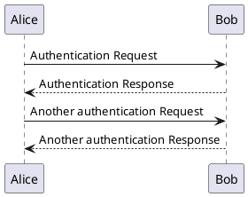
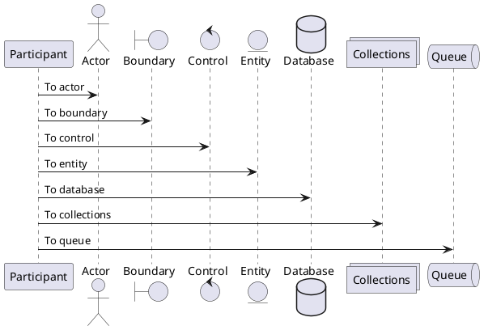
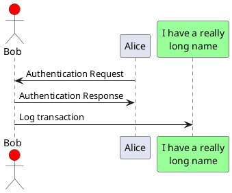
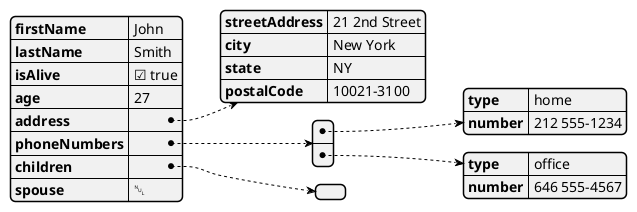
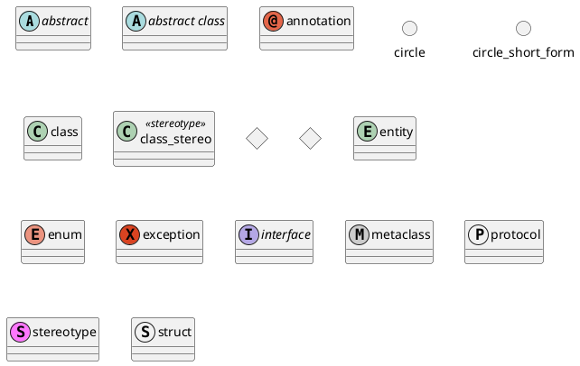
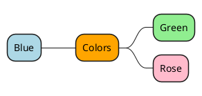

# PlantUml 图绘制

> 官网： <https://plantuml.com/zh/>

> [!ATTENTION]
> 该功能需要联网

## 序列图

```plantuml
@startuml
Alice -> Bob: Authentication Request
Bob --> Alice: Authentication Response

Alice -> Bob: Another authentication Request
Alice <-- Bob: Another authentication Response
@enduml
```

## 声明参与者

```plantuml
@startuml
participant Participant as Foo
actor       Actor       as Foo1
boundary    Boundary    as Foo2
control     Control     as Foo3
entity      Entity      as Foo4
database    Database    as Foo5
collections Collections as Foo6
queue       Queue       as Foo7
Foo -> Foo1 : To actor
Foo -> Foo2 : To boundary
Foo -> Foo3 : To control
Foo -> Foo4 : To entity
Foo -> Foo5 : To database
Foo -> Foo6 : To collections
Foo -> Foo7: To queue
@enduml

```

```plantuml
@startuml
actor Bob #red
' The only difference between actor
'and participant is the drawing
participant Alice
participant "I have a really\nlong name" as L #99FF99
/' You can also declare:
   participant L as "I have a really\nlong name"  #99FF99
  '/

Alice->Bob: Authentication Request
Bob->Alice: Authentication Response
Bob->L: Log transaction
@enduml
```

## json

```plantuml
@startjson
{
  "firstName": "John",
  "lastName": "Smith",
  "isAlive": true,
  "age": 27,
  "address": {
    "streetAddress": "21 2nd Street",
    "city": "New York",
    "state": "NY",
    "postalCode": "10021-3100"
  },
  "phoneNumbers": [
    {
      "type": "home",
      "number": "212 555-1234"
    },
    {
      "type": "office",
      "number": "646 555-4567"
    }
  ],
  "children": [],
  "spouse": null
}
@endjson
```

## 类图

```plantuml
@startuml
abstract        abstract
abstract class  "abstract class"
annotation      annotation
circle          circle
()              circle_short_form
class           class
class           class_stereo  <<stereotype>>
diamond         diamond
<>              diamond_short_form
entity          entity
enum            enum
exception       exception
interface       interface
metaclass       metaclass
protocol        protocol
stereotype      stereotype
struct          struct
@enduml

```

## 思维导图

```plantuml
@startmindmap
+[#Orange] Colors
++[#lightgreen] Green
++[#FFBBCC] Rose
--[#lightblue] Blue
@endmindmap
```
